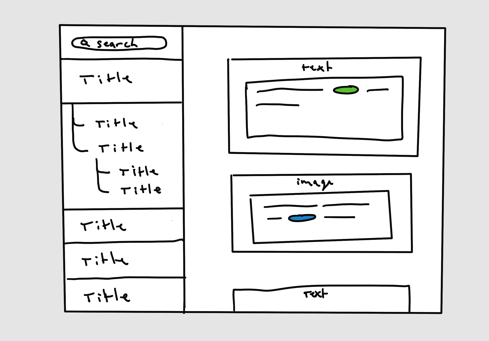
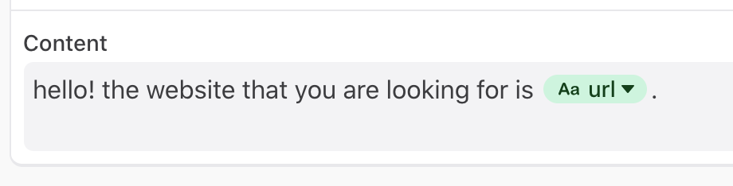

# Ada Front End Test

Welcome to the Front End Developer test! The goal of this test is to allow you to prove that you can program, as well as develop and design application interfaces. In this test, we have provided an API as well as documentation for it, and you will have to build a web interface for the aforementioned API.

This test is inspired by problems we have run into in our work and we expect you to tackle it like any other work problem. You may use any programming language as well as your favourite editor. Feel free to google-and-stackoverflow your way to success.

As for the programming challenges, we suggest you stick to the old programming mantra:

- Make it work
- Make it right
- Make it fast

The most important thing is to make it work somehow. If you then can clean it up and make it _right_, all the better. That said, we would like you to give some thought and documentation on how you would deliver your code to clients in production and let us understand the underlying assumptions of your solution. Why is this solution appropriate? How would you handle large datasets on the client? What could be potential user experience challenges in the future? How would you make this accessible? What would you change if you had more time to work on it? Please spare a few words to these assumptions and write them out; either directly as code comments or in a separate document.

As for the code, don't feel bound by what is already there. Add functions and datastructures as you see fit, and delete old code with abandon if you don't find it helpful. This is your code, so write it your way!

The most important thing is to make your solution work somehow. If you then can clean it up and make it right, all the better. As for the code, don't feel bound by what is already there. Add functions and datastructures as you see fit, and delete old code with abandon if you don't find it helpful (as long as the unit tests pass). **If you are unsure on whether to develop enterprise-edition software to show us that you know how to build serious projects please keep in mind that we at Ada strongly value readability and simplicity.**

## The Challenges 

You are working on a database-backed web-app in which you have to fix bugs and add new functionality (sounds familiar?). We have provided you with a functional backend and database that we need you to build a frontend for. Success here is in building something functional that aligns with the design direction provided while giving us an understanding of the choices you make as you build your solution.

### Designs

Your application should look something like the sketch below. 



### Challenge 1

Build a frontend component that displays information from the /nodes endpoint according to the specification outlined in the design documents.

- When you click on an item in the list view on the left side of the app, a space between that cell and the cell beneath it should show that `node`s `connections`.

- You should then be able to click on the `node`s to reveal their `connections` as well, if they exist that is.

- When you click on a diferent item in the list, it should close the connections that you are viewing and open up the connections for the node that you have clicked on.

- Any time you click on a node, it should display all of the content in the Detail View on the right side of the page.

### Challenge 2

Build an interactive frontend component that works with the /search end point and displays results as outlined in the design documents.

In the detail view, make sure to **highlight** the search terms in the text if it's in the answer's content.

*Users may have input unsafe strings to try to expose XSS vulnerabilities in our application. Make sure to render highlights and other strings in a safe and secure way.*

### Challenge 3

Build an interactive frontend component that renders the content using template strings.

Variables are represented inside of `node` content as a template string `{<idOfTheVariable>|a fallback value}`

When displaying a variable, make sure to show that it's a variable value. In the image below, we can see how the variables should look embedded in text.



## Getting Started

### Tools to Help you get Started

#### React

[create react app](https://reactjs.org/docs/create-a-new-react-app.html)

### API Setup and Docs
It should be simple to get the API that will get your web app data up and running:

1. `yarn`
2. `yarn start-server`

#### `GET /nodes`

Returns a shallow list of nodes with enough data to render a sidebar

```
[
  {
    "id": 1,
    "title": "These are the voyages"
  },
  ...
]
```

#### `GET /nodes/:id`

returns a nodes' connections to children nodes

```
[
  {
    "id": 1,
    "title": "Data on friendship",
    "connections": [
      2, // These are ID's to other nodes
      3,
      ...
    ],
    "content": [
      {...},
      ...
    ]
  },
  ...
]
```

#### `POST /nodes/search`

returns search content related to a node


```
`POST {query: "test"}`

>>>
[
    {
        "id": 2,
        "title": "Data on friendship"
    },
    {
        "id": 5,
        "title": "Maybe Data with Beard"
    },
    {
        "id": 6,
        "title": "Borg Hails"
    }
]
```

#### `GET /variables`

returns all our variable data

```
[
  {
      "id": "74c695031a554c2ebfdb2ee123c8b4f6",
      "name": "first",
      "scope": "global"
  },
  ...
]
```
